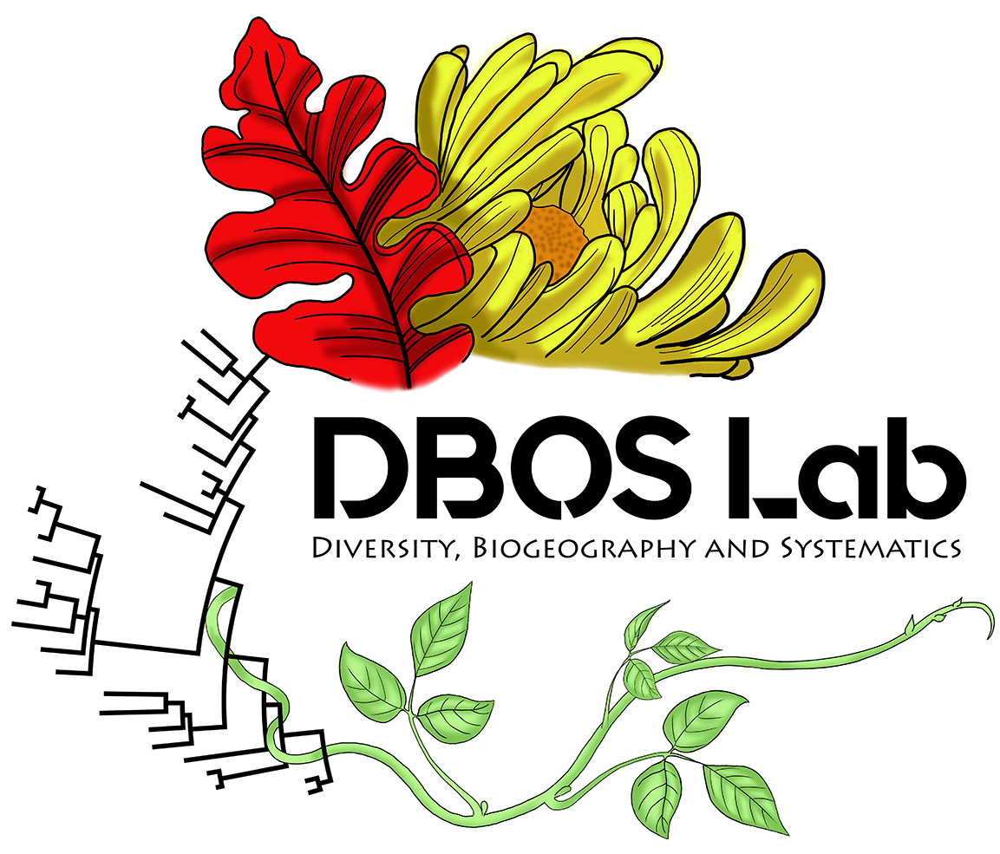

<!-- README.md is generated from README.Rmd. Please edit that file -->

```{r, include = FALSE}
knitr::opts_chunk$set(
  collapse = TRUE,
  comment = "#>",
  fig.path = "man/figures/README-",
  out.width = "100%"
)
```


# herbCur 

<!-- badges: start -->
<!-- badges: end -->

An R package for curating plant biodiversity data from herbarium collections.\
\
\

## Overview

The package **herbCur** still remains under development. It is intended to provide 
at least three major functions that help to automate the cleaning of herbarium 
records from public databases (e.g. [GBIF](https://www.gbif.org), [SEINet](https://swbiodiversity.org/seinet/), and [speciesLink](https://specieslink.net))
and generate herbarium labels from field books.

By readily standardizing the collector names and collection numbers from the herbarium
records across the publicily available biodiversity databases, the package helps
to solve the long-standing issue of identifying specimen duplicates stored among 
different herbaria.\
\
\

## Installation

You can install the development version of **herbCur** from [GitHub](https://github.com/) with:

``` r
# install.packages("devtools")
devtools::install_github("DBOSlab/herbCur")
```

```r
library(herbCur)
```
\
\

## Usage

A general description of each of the available functions (`herbLab`, `herbCol`, 
and `herbClean`) are provided below.\
\
\

#### _1. `herbLab`: Creating labels for herbarium exsiccata_

This function makes herbarium labels from field book in spreadsheet CSV format. 
It is currently more comprehensive for making herbarium labels from specimens 
collected in the USA, because it will display geographic maps also at county level. 
For specimens collected in all other countries, the label will display only the 
country level map. If geographic coordinates are provided, then the specimen record 
is also plotted in the map. The function also insert taxon authorities and nomenclatural
updates automatically, by implementing an internal function from [lcvplants](https://idiv-biodiversity.github.io/lcvplants/).\
\

##### Example of using `herbLab`:
``` r
library(herbCur)

df <- read.csv("Data/MSU_duplicates_to_HUEFS.csv", sep = ",")

herbLab(fieldbook = df,
        dir_create = "results_herbarium_labels",
        file_label = "herbarium_labels.pdf")
```
\
\
\

#### _2. `herbCol`: Standardizing collector names in plant specimen records_

This function is still underdevelopment and should be publicly available soon.\
\

##### Example of using `herbColl`:
``` r
library(herbCur)

herbColl()
```
\
\
\

#### _3. `herbClean`: Standardizing data within plant specimen records and flagging inconsistent identifications across duplicates_

This function is still underdevelopment and should be publicly available soon.\
\

##### Example of using `herbClean`:
``` r
library(herbCur)

herbClean()
```
\
\
\

## Documentation
A detailed description of the __herbCur__'s full functionality is available in 
different [articles](https://dboslab.github.io/herbCur/).\
\
\

## Citation
Cardoso, D. (2022). herbCur: An R package for curating plant biodiversity collections. https://github.com/dboslab/herbCur


